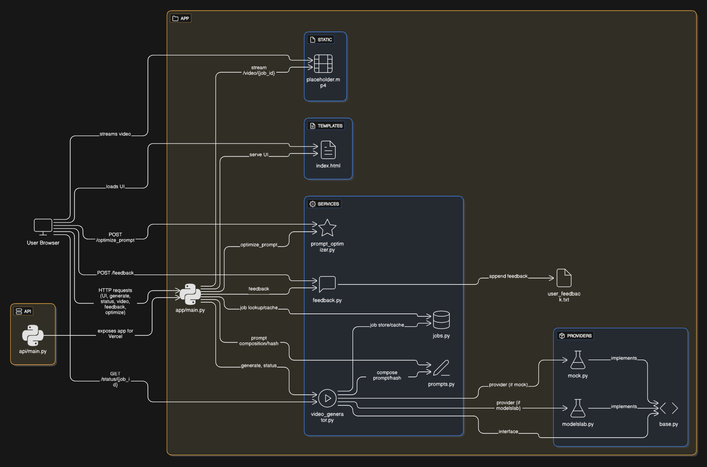

# 🎥 Peppo Video App – AI-Powered Text to Video Generator

24 hour Technical Challenge: A simple, provider-agnostic web app that helps generate **videos** from **text ideas** and **optimized prompts** using AI.  

- ⚡ **FastAPI** backend  
- ✨ **Creative idea generation** and **prompt optimization**  
- 🗂️ Clear project structure with providers & services  
- 🔑 **API key configurable** via `.env.example` (for api key configuration reference)  
- 🌍 Deployable on **Vercel / Render** with environment variables  

---

## 🌐 Demo
👉 Live App URL: [https://peppo-video-app-new.vercel.app/](https://peppo-video-app-new.vercel.app/)

---

## 📂 Project Structure

```bash
.
├── api/                      # API endpoint
├── app/                      # Core application logic
│   ├── providers/            # External provider integrations
│   ├── services/             # Business logic and services
│   ├── static/               # Static files
│   ├── templates/            # HTML templates
│   ├── main.py               # entrypoint
│   └── user_feedback.txt     # For user feedback and development cycle
├── .venv/                    # Virtual environment (ignored in git)
├── .env.example              # Sample API Key configurations
└── README.md                 # Project documentation
```

---

## 🧭 Application Workflow

> **Workflow Diagram**
>
> 
>
> _Figure 1 — High-level Application Workflow

---

## ⚙️ Run Locally

```bash
# 1. Clone the repo
git clone https://github.com/your-username/peppo-video-app.git
cd peppo-video-app

# 2. Create virtual environment
python -m venv .venv
source .venv/bin/activate   # Windows: .venv\Scripts\activate

# 3. Install dependencies
pip install -r requirements.txt

# 4. Setup environment variables
cp .env.example .env   # then add your keys inside

# 5. Start the app
uvicorn app.main:app --reload
```
